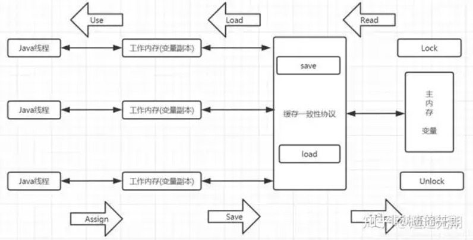

# 基本概念

# JMM内存模型

### 1. 系统内存模型图

### 2. JAVA模型图

### 3. 八大原子操作

> lock（锁定）：作用于**主内存的变量**，把一个变量标识为线程独占状态。
> unlock（解锁）：作用于**主内存的变量**，它把一个处于锁定状态的变量释放出来，释放后的变量才可以被其他线程锁定。
> read （读取）：作用于**主内存变量**，它把一个变量的值从主内存传输到线程的工作内存中，以便随后的load动作使用。
> load（载入）：作用于**工作内存的变量**，它把read操作从主存中变量放入工作内存中。
> use（使用）：作用于**工作内存中的变量**，它把工作内存中的变量传输给执行引擎，每当虚拟机遇到一个需要使用到变量的值，就会使用到这个指令。
> assign（赋值）：作用于**工作内存中的变量**，它把一个从执行引擎中接受到的值放入工作内存的变量副本中。
> store（存储）：作用于**主内存中的变量**，它把一个从工作内存中一个变量的值传送到主内存中，以便后续的write使用。
> write（写入）：作用于**主内存中的变量**，它把store操作从工作内存中得到的变量的值放入主内存的变量中。

# JVM运行时内存模型

**`全称：Java Virtual Machine`**

###  JDK7  

###  JDK8

### JDK1.7 > 1.8 虚拟机变化

- 变化点
  1.7版本有永久代，1.8没有永久代，改为元空间（metaspace）  
  永久代使用虚拟机内存空间，元空间使用的是本地内存空间

- 变化原因

  > - 不管是永久代还是元空间，他们都是方法区的具体实现
  >
  > - 之所以元空间所占的内存改成本地内存，官方的说法是为了和JRockit统一
  >
  > - 额外还有一些原因
  >
  >   比如：方法区所存储的类信息通常是比较难确定的，所以对于方法区的大小是比较难指定的，  
  >   太小了容易出现方法区溢出，太大了又会占用了太多虚拟机的内存空间，  
  >   而转移到本地内存后则不会影响虚拟机所占用的内存

# 原理与机制

### 1. <a id="class load">JAVA类加载机制</a>

- 类加载器

  - 三种类加载器：AppClassLoader、ExtClassLoader、BootstrapClassLoader，每个类加载器都有自己的加载目录
  - **双亲委派机制**
    - 向上委托查找（先找缓存然后依次向上），向下委托加载（都没找到）
    - 作用：1. 为了防止类重复加载。 2. 保护机制JAVA层类不会被覆盖

- 类加载过程：加载 > 链接 > 初始化

  1. 加载：通过获取全限定名获取二进制流，将静态存储结构转化为 **方法区** 运行时数据结构 ，内存生成java.lang.Class对象。

  2. **验证**：确保Class文件字节流中包含的信息符合当前JVM要求，进行文件格式验证，元数据验证，字节码验证，符号引用验证。

  3. **准备**：为类变量分配内存并设置`类变量`(被static修饰的变量)初始值， 变量所使用内存都在方法区中分配。

  4. **解析**：将常量池中的符合引用替换为直接引用的过程

  5. 初始化：

     执行类构造器<clinit>()方法的过程， 
     clinit()方法是由编译器自动收集类中的所有类变量的赋值动作和静态语句块中的语句合并产生的，
     执行顺序 父类静态 > 子类静态 > 父类构造 > 子类构造

- 类使用周期

  - 加载

  - 使用

  - 卸载
    - 触发条件：当一个类的ClassLoader实例被回收，同时该类没有任何活跃的实例，且没有其他地方引用该类的方法或变量时，这个类就会被卸载。
    - 回收过程：类的卸载发生在垃圾收集过程中。
    - 重要性：在使用自定义类加载器频繁加载和卸载类的场景中，类卸载机制特别重要，以避免内存泄漏。

JVM内存模型

- 堆：
  - 新生代(1/3)：eden:s1:s2 = 8:1:1
  - 老年代(2/3)

- 栈：虚拟机栈，本地方法栈
- 程序计数器:
- 元数据空间：
- DirectBuffer(nonheap)：系统直接内存，JDK1.4 NIO使用 

### 2. JVM垃圾回收器

#### 2.1  GC ROOT

- GC ROOT定义？

  `答：`JVM在进行垃圾回收时，需要找到未被引用的对象，但直接查找比较耗时，所以反过来，根据“根”的引用路径找到正常对象。
  **“根”**的特征：它**只会引用其他对象，而不会被其他对象引用**

- GC Roots的对象有哪些？

  `1. `虚拟机栈(栈帧中的本地变量表)中引用的对象
  `2. `方法区中类静态属性引用的对象
  `3. `方法区中常量引用的对象
  `4. `本地方法栈中INI(即一般说的Native方法)用的对象

#### 2.2  垃圾回收器

- CMS（Concurrent Mark Sweep）

  - 为什么要设计这么多的垃圾回收器? 

    `答：`因为内存逐渐变大

  - 什么是STW？他都发生在哪些阶段？

    `答：`STW（**Stop-The-World**）。是**在垃圾回收算法执行过程当中**，需要将JVM**内存冻结**的一种状态。在STW状态下，JAVA的所有线程都是停止执行的-GC线程除外，native方法可以执行，但是不能与JVM交互。

  - 核心算法：[标记清除](#marksweep)

  - 工作原理：将STW打散为四个阶段

    `1. `**初始标记**：STW, 标记GC Root
    `2. `**并发标记**：GC线程与业务线程并发执行
    `3. `**重新标记**：变化的对象，STW，
    `4. `**并发清除**：GC线程与业务线程并发执行，过程中有浮动垃圾

- 基于垃圾分代

  - serial + CMS/Serial Old
  - ParNew + CMS/Serial Old
  - ParallelScavenge + ParallelOld/Serial Old

- 基于垃圾不分代

  - G1(Garbage First)

    - 原理：堆内存不划分老年代和新生代，划分成每个小内存块叫做Region，每个Region隶属不同年代。

    - 四个阶段：

      `1. `初始标记:标记出GCRoot直接引用的对象。STW
      `2. `标记Region，通过RSet标记出上一个阶段标记的Region引用到的Old区Region。
      `3. ` 并发标记阶段:跟CMS的步骤是差不多的。只是遍历的范围不再是整个0Id区，而只需要遍历第二步标记出来的Region.
      `4. `重新标记: 跟CMS中的重新标记过程是差不多的。

    - 垃圾清理: 与CMS不同的是，G1可以采用拷贝算法，直接将整个Region中的对象拷贝到另一个Region。而这个阶段，G1只选择垃圾较多的Region来清理，并不是完全清理

  - shennandoah(非官方， G1 升级版)

  - Epsilon

  - ZGC: 未来GC

#### 2.3  垃圾回收算法

- MarkSweep标记清除

  - 原理：`（三色标记）`一种逻辑上的抽象，将内存对象分成三种颜色。
    `黑色:`自己和成员对象都标记完毕
    `灰色:`自己标记完毕，成员对象未标记完毕
    `白色:`自己未标记完毕

  - 缺陷：

    `1. `漏标记：A>B>C 同时A>C, 当C不可达时被标记为回收但是A引用了C，可用**增量标记解决**
    `2. `产生内存碎片：使用**拷贝算法解决**

- Copying拷贝

  - 原理：将内存分为大小相等的对半，每次只使用其中一半，垃圾回收时，将当前这一块的存活对象全部拷贝到另一半，当前这一半可全部清除
  - 缺陷：浪费空间，而且效率跟内存对象的数量有关系： 使用**标记压缩算法解决**

- MarkCompack标记压缩

  - 原理：在标记阶段跟标记清除算法一样，区别在**完成标记之后，不直接清理垃圾内存，而是将存活对象往一端移动，然后将端边界以外的所有内存直接清除**。
  - 缺陷：算法复杂度更高

# JVM调优

### 1. 为什么要JVM调优

`答：`**为了GC时减少STW**。

### 2. JVM参数有哪些

分为三类：
`1. `标准指令：-开头，所有hotspot都支持的参数。java -help打印
`2. `非标准指令：-X开头，通常跟特定的hotspot版本对应的。java -X打印
`3. `不稳定参数：-XX开头，

### 3. 1.8版本常用指令

`java -XX:+PrintCommandLineFlags -version `   查看所有不稳定指令
`java -XX:+PrintFlagsInitial`  查看所有不稳定指令默认值
`java -XX:+PrintFlagsFinal`  查看所有不稳定指令最终生效的实际值

### 4. 常用调优工具

#### 4.1 Arthas

`java -jar arthas.jar`: 启动arthas
`thread -d`: 查看线程死锁
`dashboard`: 查看堆中分代情况，查看线程，查看runtime信息

#### 4.2 JProfile

#### 4.3 [GCeasy](https://gceasy.io/)

#### 4.4 JDK 官方工具类

- `jps 查进程id`
- `jmap -histo` 进程id 查看堆对象大小
- `jmap -heap` 进程号 jvm内存配置
- `jmap -dump:format=b,file=ssss.hprof 进程号` 
- `jstack 进程号 && visualVM检测` 查询死锁 `found one java-level deadlock` 监测并显示JVM的性能统计信息
- `jstat -gc 进程号` 动态gc打印 ，监测并显示JVM的性能统计信息
- `jinfo -flags 进程号` 查看jvm参数
- `jcmd: ` 用于向正在运行的JVM发送诊断命令请求

### 5. 常用JVM参数

> -XX:+UseContainerSupport 
> -XX:InitialRAMPercentage=70.0 
> -XX:MaxRAMPercentage=70.0 
> -XX:+PrintGCDetails 
> -XX:+PrintGCDateStamps 
> -Xloggc:/home/admin/nas/gc-${POD_IP}-$(date '+%s').log 
> -XX:+HeapDumpOnOutOfMemoryError 
> -XX:HeapDumpPath=/home/admin/nas/dump-${POD_IP}-$(date '+%s').hprof
> -XX:MaxMetaspaceSize=256MB
> -XX:ActiveProcessorCount=CPU个数（实际使用和指定数量不同会导致jvm效率低下）

# 面试题

### 1. [双亲委派模型工作原理](#class load)

> 总纲：向上加载，向下委派：
> 过程：所有类加载器收到类加载时指派给父类进行加载，当父类加载器反馈无法加载时，才由子类加载器进行加载。

### 2. GC如何判断对象可以被回收

- `引用计数法`: 
  - 每个对象有一个引用计数属性，新增一个引用时计数加1，引用释放时计数减1，计数为0时可以回收
  - `缺点:` 可能会出现A引用了 B，B又引用了A，这时候就算他们都不再使用了，但因为相互引用 计数器=1 永远无法被回收
  - `优点：`效率高
- `可达性分析法`:从 GCRoots开始向下搜索，搜索所走过的路径称为引用链。当一个对象到 GC Roots 没有任何引用链相连时，则证明此对象是不可用的，那么虚拟机就判断是可回收对象。
- 可达性算法中的不可达对象并不是立即死亡的，对象拥有一次自我拯救的机会。
  对象被系统宣告死亡至少要经历两次标记过程: 
  第一次是经过可达性分析发现没有与GCRoots相连接的引用链，
  第二次是在由虚拟机自动建立的Finalizer队列中判断是否需要执行finalize()方法。
- 当对象变成(GC Roots)不可达时，GC会判断该对象是否覆盖了finalize方法，
  若未覆盖，则直接将其回收。
  否则,若对象未执行过finalize方法，将其放入F-Queue队列，由一低优先级线程执行该队列中对象的finalize方法。
  执行finalize方法完毕后，GC会再次判断该对象是否不可达，进行回收，否则，对象“复活"
  **每个对象只能触发一次finalize()方法**
  由于finalize()方法运行代价高昂，不确定性大，无法保证各个对象的调用顺序，不推荐大家使用，建议遗忘它。

### 4. 怎么查看一个JAVA进程的JVM参数

> 1.`jcmd` 查询进程号
> 2.`jcmd <进程号> VM.command_line`  jvm_args中查询标准和非标准jvm参数
> 3.`jcmd <进程号> VM.flags` 查询不稳定参数

### 5. 谈谈你了解的JVM参数。

### 6. 程序运行一段时间变得非常卡顿，优化思路

### 7. 项目中遇到什么样的问题，如何进行调优

### 8. 如何排查JVM问题

- 对于还在正常运行的系统:

  `1. `可以使用jmap来查看JVM中各个区域的使用情况
  `2. `可以通过jstack来查看线程的运行情况，比如哪些线程阻塞、是否出现了死锁
  `3. `可以通过jstat命令来查看垃圾回收的情况，特别是fullgc，如果发现fullgc比较频繁，那么就得进行调优了
  `4. `通过各个命令的结果，或者jvisualvm等工具来进行分析
  `5. `首先，初步猜测频繁发送fullgc的原因，如果频繁发生fullgc但是又一直没有出现内存溢出，那么表示fullgc实际上是回收了很多对象了，所以这些对象最好能在youngc过程中就直接回收掉，避免这些对象进入到老年代，对于这种情况，就要考虑这些存活时间不长的对象是不是比较大，导致年轻代放不下，直接进入到了老年代，尝试加大年轻代的大小，如果改完之后，fullgc减少，则证明修改有效
  `6. `同时，还可以找到占用CPU最多的线程，定位到具体的方法，优化这个方法的执行，看是否能避免某些对象的创建，从而节省内存

- 对于已经发生了OOM的系统:
  `1. `生产系统中设置当系统发生了OOM时，生成当时的dump文件(`-XX:+HeapDumpOnOutOfMemoryError -XX:HeapDumpPath=/usr/local/base`)
  `2. `我们可以利用jvisualvm或者jprofile等工具来分析dump文件
  `3. `根据dump文件找到异常的实例对象，和异常的线程(占用CPU高)，定位到具体的代码
  `4. `然后再进行详细的分析和调试

- 总之，调优不是一蹴而就的，需要分析、推理、实践、总结、再分析，最终定位到具体的问题

### 9. New 对象是否一定会分配堆中

### 10. 对象逃逸如何分析

### 11. jvm参数设置经验

1.Xmx 与 Xms设置大小一致
2.设置GC垃圾回收器标准：cpu >= 2 & mem > 1792MB ? G1(Java9 之前选ParallelGC) : SerialGC
3.容器部署，堆内存范围`-XX:MaxRAMPercentage=50%~75%`
4.一个容器cpu 2000m， 优于2个容器 cpu 1000m

### 12. CPU飙升怎么办

`top` 查看资源占用情况
`top 进程号 + H` 查看当前进程下所有线程情况
使用visualVM找到线程对应的代码（十进制转十六进制）
`jstack 进程号 | grep -A 10 <十六进制值>` 找到代码行

# 调优场景

### 场景1：JVM频繁FGC

- 现象：

  - 机器配置2核4G
  - JVM 内存：2G
  - 系统运行时间：7天
  - 发生fullGC 次数和耗时：500多次， 200多秒
  - 发生young gc次数和耗时：1W多次，500多秒

- JVM配置

  -Xms1536M
  -XmX1536M
  -Xmn512
  -XSS256K
  -XX:SurvivorRatio=6
  -XX:MetaspaceSize=256M
  -XX:MaxMetaspaceSize=256M
  -XX:+UseParNewGC
  -XX:+UseConcMarkSweepGC
  -XX:CMSInitiatingOccupancyFraction=75 `old75%触发FGC`
  -XX:+UseCMSInitiatingOccupancyOnly

- 年轻代增长速率：

  YGC触发频率和每次耗时： 每次YGC 50ms

  每次YGC 后有多少对象存活和进入老年代

  FGC触发频率和每次耗时：20分钟一次，每次fGC 400ms

- old区1G, 20分钟700M到老年代

  `可能原因：高峰情况下，对象太大，触发了担保机制直接进入老年代`

- 第一步优化： -Xmn1024  -XX:CMSInitiatingOccupancyFraction=92

  `调整后现象，fgc多于minor gc`

  `可能原因：触发担保机制 或者 metaspace空间不够导致扩容了`

- 通过jmap -histo 进程号查看堆内存对象情况， 

  byte[] 几百兆，然后找自己定义的类，对象个数10W+,

  通过方法执行过程中CPU飙升情况，通过`jstack`找到线程对应的代码方法。

  `找到了有个查询一次查5000条数据，查询对象太大了`。

- 第二步优化： 减少分页查询大小

  使用`jstat`查看发现不进行FGC问题

### 场景2：系统运一周后OOM

