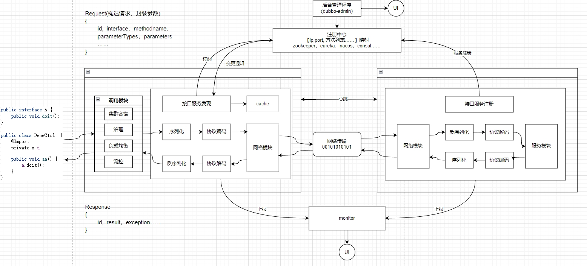

# Network

### 网络体系结构

#### 1. OSI 七层

#### 2. TCP/IP 五层

- 传输层（Tcp： transmission control protocol）

  - 端口：65535个， 端口由16位二进制表示，2^16 - 1(除0) = 65535个

- 网络层（IP: Internet protocol）

- 数据链路层（Lvs：linux virtual server， 负载均衡）

- 一个链接五个确定维度：**源ip，源port，目标ip，目标port，协议号**

#### 3. TCP 传输控制协议

- 特性：`面向链接，可靠的数据流服务，一次建立，超时重传 & 应答机制保证其可靠性，全双工` 。

- 三次握手（建立）
  
  - 过程
  
  
  
  - 漏洞：
  
    > SYN洪泛攻击
  
- 四次挥手（关闭，释放）

#### 4. UDP 用户数据报协议

- User Datagram Protocol 是一种无连接的， 不可靠的、传输层通信协议。 

#### 5. HTTP和HTTPS

- 定义

  **HTTP**： 基于TCP，可以使浏览器工作更为高效，减少网络传输。
  **HTTPS**： 
  是HTTP的加强版，可以认为是HTTP+SSL(Secure Socket Layer)。
  在HTTP的基础上增加了一系列的安全机制。一方面保证数据传输安全，另一位方面对访问者增加了验证机制。

- 区别：
  1、HTTP的连接是简单无状态的，HTTPS的数据传输是经过证书加密的，安全性更高。
  2、HTTP是免费的，而HTTPS需要申请证书需要收费
  3、端口不一样。HTTP默认80，HTTPS默认443。

- HTTPS的缺点：
  1、HTTPS的握手协议比较费时，所以会影响服务的响应速度以及吞吐量。
  2、HTTPS也并不是完全安全的。他的证书体系其实并不是完全安全的。
  并且HTTPS在面对DDOS这样的攻击时，几乎起不到任何作用。
  3、证书需要费钱，并且功能越强大的证书费用越高。

### RPC

#### 1. 架构

- 调用模块-代理
- 序列化
- 协议编码
- 网络模块

#### 2. 调用过程

### Socket

- 通信流程

  

- 

### [Netty](https://cloud.tencent.com/developer/article/1754078)

# IO（Input/Output）

### JAVA IO模型

|                                                         | 同步 | 阻塞 | 可靠性 | 吞吐量 | 复杂度 | 适用场景                                                     | JDK    |
| ------------------------------------------------------- | ---- | ---- | ------ | ------ | ------ | ------------------------------------------------------------ | ------ |
| [BIO](../pictures/java/java io.png) (block)        | √    | √    | 低     | 低     | 最简单 | 连接少 场景固定                                         | < 1.4  |
| [NIO](../pictures/java/java io.png) (non-blocking) | √    | √    | 较好   | 较高   | 复杂   | 并发高，短连接（轻操作） 例如：聊天室                   | >= 1.4 |
| [AIO](../pictures/java/java io.png) (asynchronous) | ×    | ×    | 最好   | 最高   | 简单   | 并发高，长连接（重操作） 例如：相册服务器 `(需要操作系统来支持)` | 7      |

### JAVA NIO核心组件

- Buffer

  > 和Channel都是可读可写的。

- channel

  > 类似于一流。 每个channel对应一个buffer缓冲区。channel会注册到selector。

- selector

  > 会根据channel上发生的读写事件，将请求交由某个空闲的线程处理。selector对应一个或者多个线程。

### IO 多路复用

> 通过一种机制，让单个进程可以监视多个描述符，  
> 当发现某个描述符就绪之后，能够通知程序进行相应的读写操作。

### Select、Poll、Epoll

- **定义**：NIO中**多路复用的三种实现机制**，由**Linux操作系统提供**。

- **原理**

  - 用户空间和内核空间

    > 操作系统为了保护系统安全，将内核划分为两个部分，一个是用户空间，一个是内核空间。  
    > 用户空间不能直接访问底层的硬件设备，必须通过内核空间。

  - 文件描述符 File Descriptor(FD)

    > 是一个抽象的概念，形式上是一个整数，实际上是一个索引值。  
    > 指向内核中为每个进程维护进程所打开的文件的记录表。  
    > 当程序打开一个文件或者创建一个文件时， 内核就会向进程返回一个FD。Unix,Linux

  - select机制

    > 维护一个FD的结合 **fd_set数组结构**。x32大小：1024， x64大小：2048  
    > 将fd_set从用户空间复制到内核空间，激活socket。 

  - Poll机制

    > 和selecter机制是差不多的，把fd_set结构进行了优化，FD集合的大小就突破了操作系统的限制。  
    > poll fd结构来代替fd_set，通过链表实现的。

  - EPoll（Event Poll）

    > Epoll不再扫描所有的FD，只将用户关心的FD的事件存放到内核的一个事件表当中。
    > 这样，可以减少用户空间与内核空间之前需要拷贝的数据。

- **区别**

  |        | 操作方式 | 底层实现 | 最大连接数                      | IO效率 | 是否同步 | 年代 |
  | ------ | -------- | -------- | ------------------------------- | ------ | -------- | ---- |
  | select | 遍历     | 数组     | 受限于内核 ( 1024 或 2048) | 一般   | 是       | 1984 |
  | pol    | 遍历     | 链表     | 无上限                          | 一般   | 是       | 1997 |
  | epol   | 事件回调 | 红黑树   | 无上限                          | 高     | 是       | 2002 |

- **JAVA 默认模式**

  > 查看DefaultSelectorProvider源码。
  >
  > windows： WindowsSelectorProvider。
  > Linux： `内核版本 > 2.6`  **？**`EPollSelectorProvider`  **：** `PollSelectorProvider`

# 面试

### 1. socket 与 rpc， http协议， dubbo协议区别

- rpc: 进程之间通信方式，远程过程调用，是一种服务调用模式。包含 **传输协议** 和 **序列化协议**

  

- http协议 相较于 自定义tcp 报文协议：**增加的开销在于连接的建立与断开。**

- 比如著名的 grpc，它底层使用的是 http2 协议；还有 dubbo 一类的自定义报文的 tcp 协议

